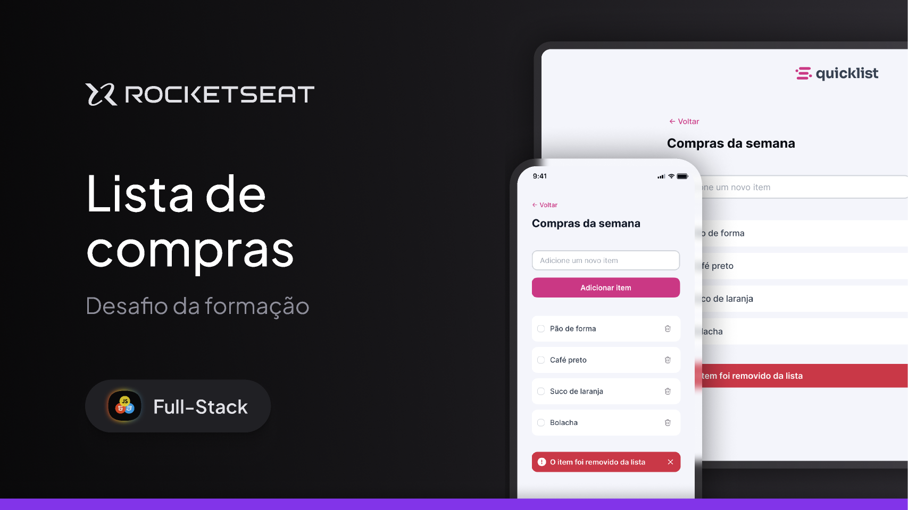

  

O projeto é um site responsivo de lista de compras onde o usuário pode gerenciar os itens adicionando e removendo eles. 

  <a href="#-tecnologias">Tecnologias</a>&nbsp;&nbsp;&nbsp;|&nbsp;&nbsp;&nbsp;
  <a href="#-projeto">Projeto</a>&nbsp;&nbsp;&nbsp;|&nbsp;&nbsp;&nbsp;
  <a href="#memo-licença">Licença</a>

  

 

  

  👉 <a href="https://novaesdg.github.io/quicklist/"><strong>Clique aqui para acessar o site</strong></a>

## 🚀 Tecnologias

Esse projeto foi desenvolvido com as seguintes tecnologias:

- HTML
- CSS
- JavaScript

## Projeto

O projeto é um site responsivo de lista de compras onde o usuário pode gerenciar os itens adicionando e removendo eles. 

___

Made by Diogo Novaes 👋🏽 [Get in Touch!](https://www.linkedin.com/in/diogonovaesc/)
